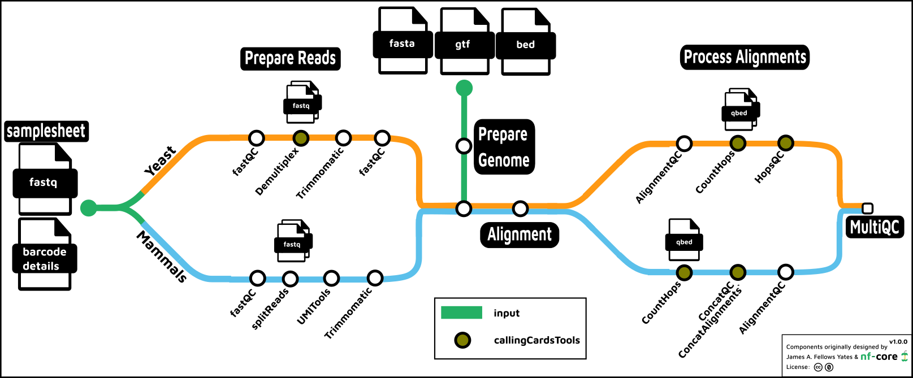

#  

[](https://github.com/nf-core/callingcards/actions?query=workflow%3A%22nf-core+CI%22)
[](https://github.com/nf-core/callingcards/actions?query=workflow%3A%22nf-core+linting%22)[](https://nf-co.re/callingcards/results)[](https://doi.org/10.5281/zenodo.XXXXXXX)

[](https://www.nextflow.io/)
[](https://docs.conda.io/en/latest/)
[](https://www.docker.com/)
[](https://sylabs.io/docs/)
[](https://tower.nf/launch?pipeline=https://github.com/nf-core/callingcards)

[](https://nfcore.slack.com/channels/callingcards)[](https://twitter.com/nf_core)[](https://mstdn.science/@nf_core)[](https://www.youtube.com/c/nf-core)

## Introduction

**nf-core/callingcards** is a bioinformatics pipeline that can be used to process raw Calling Cards data obtained from either mammals (human, mouse) or yeast. It takes a samplesheet, which describes the sample names, paths to the fastq files, and paths to the barcode details json files, a parameter which identifies the
organism type (either mammals or yeast) and either the name of the reference genome on `igenomes` or paths to the fasta/gff. It then parses the reads, counts the
number of calling cards insertions, and provides some QC metrics.



1. Prepare the Genome
   - optional masking with [bedtools](https://bedtools.readthedocs.io/en/latest/)
   - Create aligner specific indicies. Available aligners:
     - [bowtie](https://bowtie-bio.sourceforge.net/index.shtml)
     - [`bowtie2`](http://bowtie-bio.sourceforge.net/bowtie2/index.shtml)
     - [`bwa`](http://bio-bwa.sourceforge.net/)
     - [`bwamem2`](https://github.com/bwa-mem2/bwa-mem2)
   - Create a genome index with [samtools](http://www.htslib.org/)
2. Prepare the Reads
   - Read QC ([`FastQC`](https://www.bioinformatics.babraham.ac.uk/projects/fastqc/))
   - Split reads
     - Yeast: demultiplex by barcode ([`callingCardsTools`](https://github.com/cmatKhan/callingCardsTools))
     - Mammals: split for parallel processing ([`seqkit`](https://bioinf.shenwei.me/seqkit/))
       - Mammals: extract barcode to fastq read ID( [UMItools](https://umi-tools.readthedocs.io/en/latest/QUICK_START.html))
   - Optionally trim reads ([Trimmomatic](http://www.usadellab.org/cms/?page=trimmomatic))])
3. Align
   - Any one of the aligners listed above in 'Prepare the Genome'
   - Alignment QC ([`samtools`](http://www.htslib.org/),
     [picard](https://broadinstitute.github.io/picard/),[rseqc](http://rseqc.sourceforge.net/))))
4. Count Hops ([`callingCardsTools`](https://cmatkhan.github.io/callingCardsTools/))
5. Present QC data ([`MultiQC`](http://multiqc.info/))

## Usage

:::note
If you are new to Nextflow and nf-core, please refer to [this page](https://nf-co.re/docs/usage/installation) on how
to set-up Nextflow. Make sure to [test your setup](https://nf-co.re/docs/usage/introduction#how-to-run-a-pipeline)
with `-profile test` before running the workflow on actual data.
:::

First, prepare a samplesheet with your input data according to your organism.

A Yeast samplesheet will look like:

`yeast_samplesheet.csv`:

```csv
sample,fastq_1,fastq_2,barcode_details
run_6177,run_6177_sample_R1.fastq.gz,run_6177_sample_R2.fastq.gz,run_6177_barcode_details.json
```

Each row represents a multiplexed fastq file where the barcode_details.json file
describes the barcodes which correspond to each transcription factor in the library.

A mammals (human, mouse) samplesheet will look like:

`mammals_samplesheet.csv`:

```csv
sample,fastq_1,fastq_2,barcode_details
midbrain_rep3,midbrain_rep3_R1.fastq.gz,,barcode_details.json
```

Note that currently, the mammals workflow expects only R1 reads.

Now, you can run the pipeline using:

```bash
nextflow run nf-core/callingcards \
   -profile <docker/singularity/.../institute>,<default_yeast/default_mammals> \
   --input samplesheet.csv \
   --genome <igenomes_name (only required for mammals)> \
   --outdir <OUTDIR>
```

Note that the [default_yeast](conf/default_yeast.config) and
[default_mammals](conf/default_mammals.config) profiles are provided for
convenience. You should check the parameters which these set to ensure that
they are what you need for your data.

:::warning
Please provide pipeline parameters via the CLI or Nextflow `-params-file` option. Custom config files including those
provided by the `-c` Nextflow option can be used to provide any configuration _**except for parameters**_;
see [docs](https://nf-co.re/usage/configuration#custom-configuration-files).
:::

For more details and further functionality, please refer to the [usage documentation](https://nf-co.re/callingcards/usage) and the [parameter documentation](https://nf-co.re/callingcards/parameters).

## Pipeline output

To see the results of an example test run with a full size dataset refer to the [results](https://nf-co.re/callingcards/results) tab on the nf-core website pipeline page.
For more details about the output files and reports, please refer to the
[output documentation](https://nf-co.re/callingcards/output).

## Credits

nf-core/callingcards is implemented in nextflow by [Chase Mateusiak](https://orcid.org/0000-0002-2890-4242). It was adapted from scripts written by:

- [Rob Mitra](https://orcid.org/0000-0002-2680-4264)

We thank the following people for their extensive assistance in the development of this pipeline:

- [Allen Yen](https://orcid.org/0000-0002-3984-541X)
- [Mari Gachechiladze](https://dbbs.wustl.edu/people/mari-gachechiladze-mstp-in-phd-training/)
- [Joseph Dougherty](https://orcid.org/0000-0002-6385-3997)

## Contributions and Support

If you would like to contribute to this pipeline, please see the [contributing guidelines](.github/CONTRIBUTING.md).

For further information or help, don't hesitate to get in touch on the [Slack `#callingcards` channel](https://nfcore.slack.com/channels/callingcards) (you can join with [this invite](https://nf-co.re/join/slack)).

## Citations

<!-- TODO nf-core: Add citation for pipeline after first release. Uncomment lines below and update Zenodo doi and badge at the top of this file. -->
<!-- If you use  nf-core/callingcards for your analysis, please cite it using the following doi: [10.5281/zenodo.XXXXXX](https://doi.org/10.5281/zenodo.XXXXXX) -->

An extensive list of references for the tools used by the pipeline can be found in the [`CITATIONS.md`](CITATIONS.md) file.

You can cite the `nf-core` publication as follows:

> **The nf-core framework for community-curated bioinformatics pipelines.**
>
> Philip Ewels, Alexander Peltzer, Sven Fillinger, Harshil Patel, Johannes Alneberg, Andreas Wilm, Maxime Ulysse Garcia, Paolo Di Tommaso & Sven Nahnsen.
>
> _Nat Biotechnol._ 2020 Feb 13. doi: [10.1038/s41587-020-0439-x](https://dx.doi.org/10.1038/s41587-020-0439-x).
